# Lab Report 1 (Week 2)

1. **Installing VSCode:**

Go to the [VSCode website](https://code.visualstudio.com/) and download the version for your operating system by following the prompted instructions. The website should suggest the version for your system, but if not, scroll to the bottom of the web page for other versions.

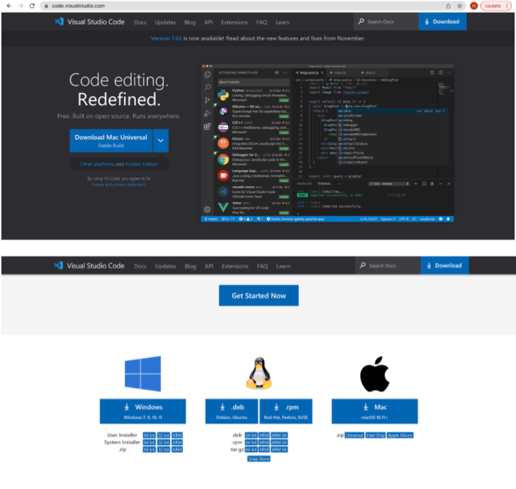

Once VSCode has been installed on your system, you should see a window similar to the one below upon launching:

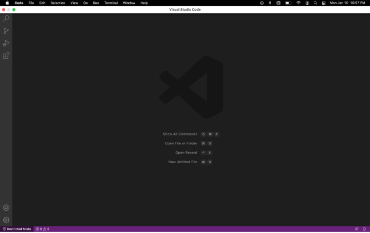

---

2. **Remotely Connecting:**

*If your system is Windows*, follow the steps on this [website](https://docs.microsoft.com/en-us/windows-server/administration/openssh/openssh_install_firstuse) to install OpenSSH.
 
Find the course account ucsd has provided you by entering your information in this [website](https://sdacs.ucsd.edu/~icc/index.php) (you will have to change your password after retrieving this information).
 
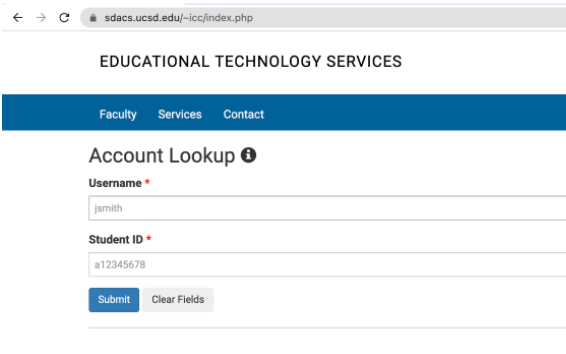

Open a terminal in VSCode by clicking on Terminal -> New Terminal in the menu as below:

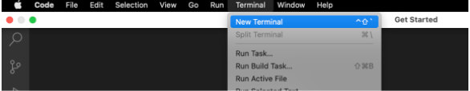

Copy and paste `ssh <your course account>@ieng6.ucsd.edu` into your terminal, and if you see a message on your terminal as below, indicate `yes`:

In the password prompt that appears, enter the password you set when you looked up your course account (the password will not be visible to you while you are typing it in). You will now be logged into an ieng6 system and your terminal should look similar to the one below:

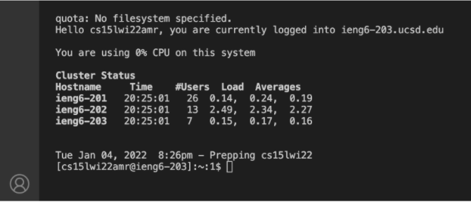

---

3. **Trying some commands:**

Use the `pwd` command to display the path to the directory you are currently in, and use the `ls` command to list the files and directories in your current directory. 

Use `cd` followed by a space and the name of the subdirectory you want to enter from the current one, and use `cd ~` to return to your home directory. 

To create a new directory under the directory you are in, use `mkdir` followed by the name of the directory you want to create.

To copy a file from your current directory into a subdirectory, use `cp <name of the file to move> <name of the subdirectory>`.

Here is an example of using the above commands on a local system:

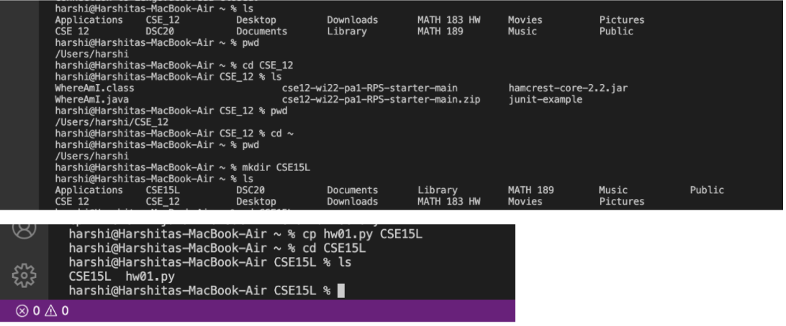

Here is an example of using `ls` and `pwd` on the ieng6 server. In addition, to log out of the ieng6 system, just type `exit` into the terminal, or use Ctrl+D.

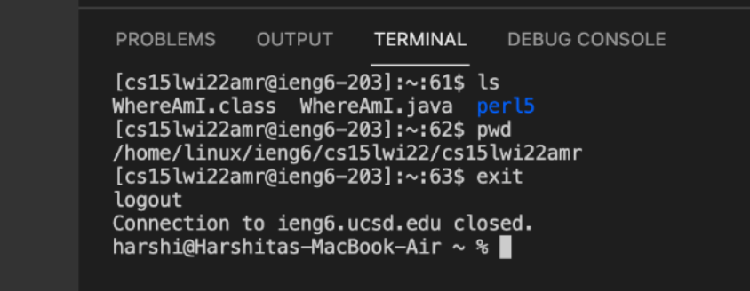

---

4. **Moving files with scp:**

Create a new file through VSCode by clicking on File -> New File in the menu as below, enter the code and text desired into the file and save it (make sure you are creating and moving the file while logged out of the ieng6 system). 

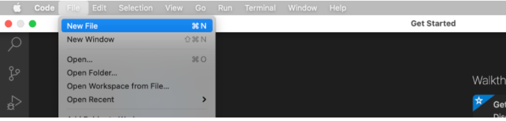

While in the directory you created your file, type `scp <your file name>.<file extension> <your course account>@ieng6.ucsd.edu:~/` into your terminal and hit enter, and when the password prompt appears, use the same password as for ssh. The file has now been moved, and should be in the home directory when you log into ieng6 using ssh next.

Here is the scp command and result of moving a sample file WhereAmI.java:

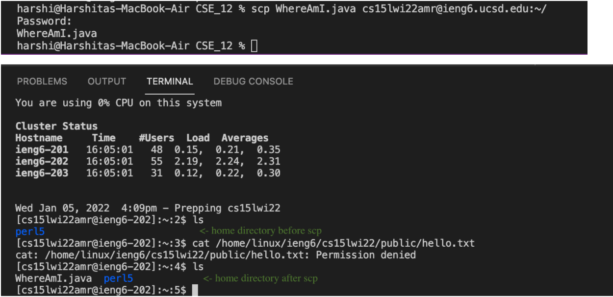

---

5. **Setting an SSH Key**

While logged out of ieng6 enter `ssh-keygen` into your terminal, and when prompted to enter the file in which to save the key, copy paste the path provided in the parentheses and hit enter as seen below:

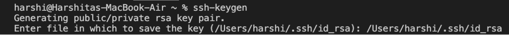

When asked to enter a passphrase, hit enter, and do so again for the enter the password again prompt, after which your terminal will look similar to below:

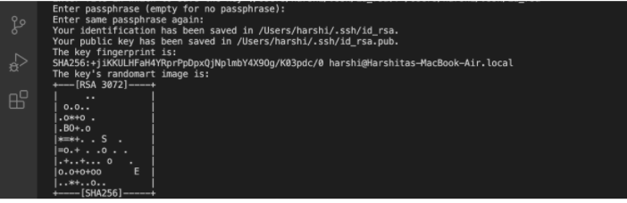

*If your system is Windows*, follow the steps on this [website](https://docs.microsoft.com/en-us/windows-server/administration/openssh/openssh_keymanagement#user-key-generation) for `ssh-add`.

Now log into the ieng6 server using `ssh <your course account>@ieng6.ucsd.edu`, enter your password, enter `mkdir .ssh` into the terminal and then logout. Once back on your local system, enter `scp <The path where you saved the key in the keygen step>/.ssh/id_rsa.pub <your course account>@ieng6.ucsd.edu:~/.ssh/authorized_keys` into your terminal, which should look as below:

You should now be able to use ssh and scp commands from your system without having to enter a password to log into an ieng6 server:

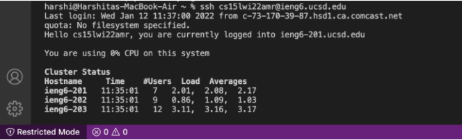

---

6. **Optimizing Remote Running**

To run commands by logging into the ieng6 server logging out automatically after, enter `ssh <your course account>@ieng6.ucsd.edu` followed by the command you desire in quotes, as seen in the first command in the image. 

To similarly run multiple commands in a line, within quotes, separate the commands using a semicolon, as in the third command in the image. To run multiple commands on your own system, simply type in the command separated by semicolons as in the fifth command. 

To recall previous commands you entered in the terminal, use the up and down arrows (for example, the final command below was entered by using the up arrow five times).

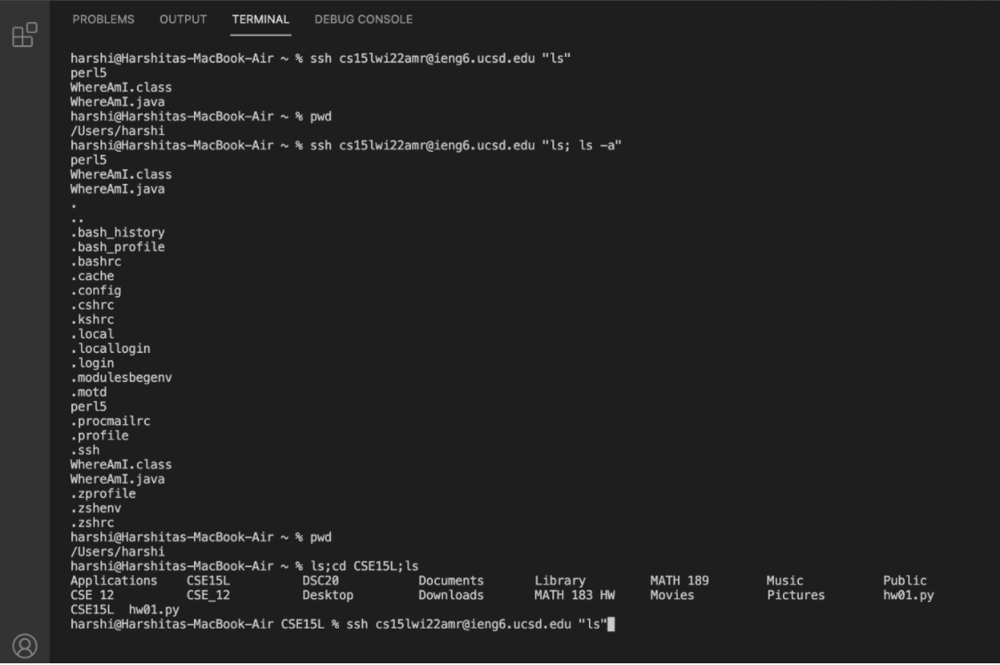

