# Lab Report 2 (Week 4)

**Important links:**

- [Link to repository with all mentioned files](https://github.com/harshi-cse/markdown-parse)
- [Link to MarkdownParse.java](https://github.com/harshi-cse/markdown-parse/commits/main/MarkdownParse.java)
- [Link to MarkdownParseTester.java](https://github.com/harshi-cse/markdown-parse/blob/main/MarkdownParseTest.java)

---
**Setup:**

This is our [starter code](https://github.com/harshi-cse/markdown-parse/commit/b8d6a71999434efefe7cce938873161db28a8629#diff-c703a0ec03474d601c6bf846740b293e0538bccf38d5f677a302457479e9c652), with a print line added so that we can visualize what exactly the program is doing in order to extract and print links from the passed test file.

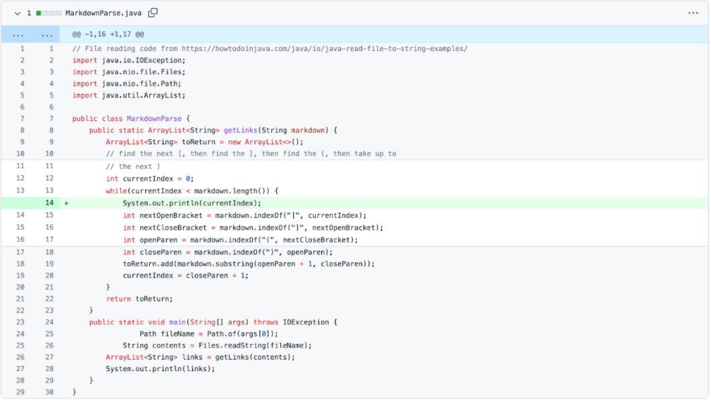

This code was run on test-file.md([blob](https://github.com/harshi-cse/markdown-parse/blob/main/test-file.md), [raw](https://raw.githubusercontent.com/harshi-cse/markdown-parse/main/test-file.md)), whose contents are seen below.

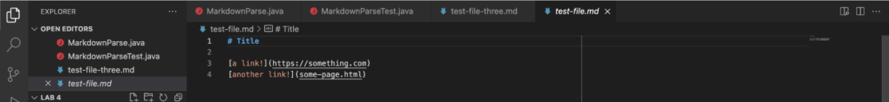

In the terminal of the image below, when test-file.md is run with MarkDownParse.java, we can see the output gives valid links in the file, and we can also see that the test written for this specific case in the MarkdownParseTest.java file (also seen in the image) has passed.

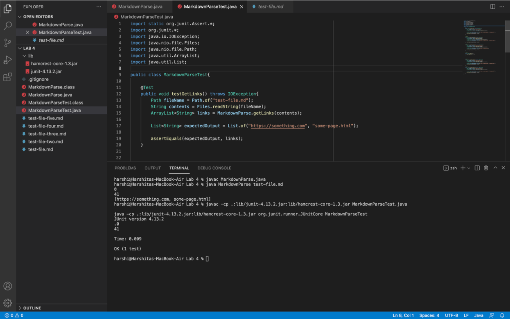

---

**Change 1:**

*Before change for case 1:*

With no further changes made to the code in MarkdownParse.java, we test the file on test-file-two.md([blob](https://github.com/harshi-cse/markdown-parse/blob/main/test-file-two.md), [raw](https://raw.githubusercontent.com/harshi-cse/markdown-parse/main/test-file-two.md)). 

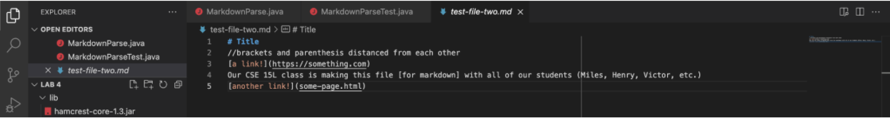

**Failure inducing input:** 

As seen in the contents of test-file-two.md, line four contains a sentence that has square brackets and parentheses that are separated by words in between them. Since our code is only supposed to print out links in the file, the contents within the parentheses in line four should not be in the output. 

**Symptom:** 

In the terminal of the image below, when the test-file-two.md file is run with MarkDownParse.java, we see that the output does in fact however, return the contents within the parentheses in line four of  test-file-two.md, and we also see that the test written for this specific case in the MarkdownParseTest.java file (also seen in the image, with expected values excluding the contents in parentheses in line four) has failed.

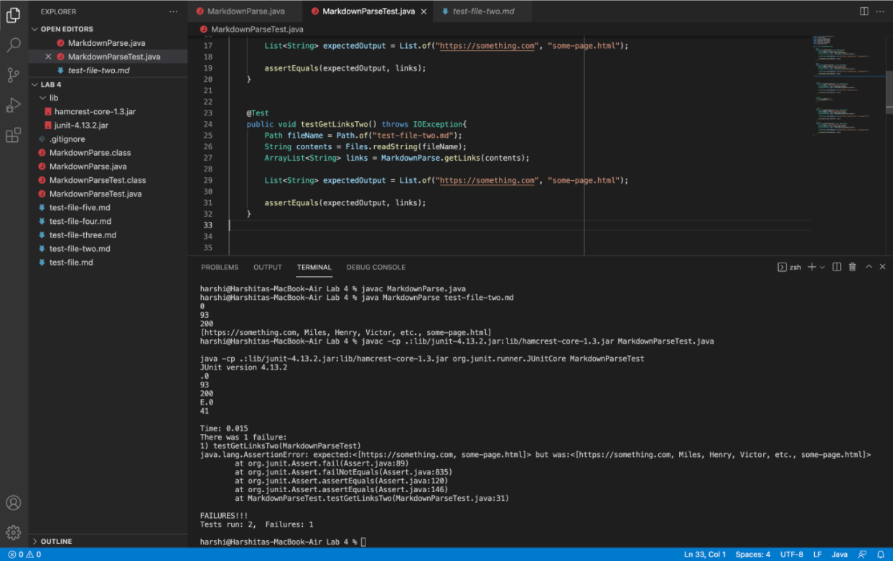

**Bug:**

In order to fix our output for case 1, our code must take into account the syntax of links in markdown, which dictates that there must not be a space between the `]` and `(` in the `[<link text>](<link url>)` link format. Currently, the code does not check for this, and simply returns the contents within the open and closed parentheses following the closed bracket, regardless of the distance between the closed bracket and the open parenthesis. 

*Change for case 1:*

In [the code changes seen below](https://github.com/harshi-cse/markdown-parse/commit/75564bd2efcb5dc8f590007e114a74234f45f97e#diff-c703a0ec03474d601c6bf846740b293e0538bccf38d5f677a302457479e9c652), we removed the print line and previous declarations of variables storing the indices of the parentheses. We then declared variables containing indices of the parentheses inside an if statement that would be entered only if the character in the index following the index of the closed bracket was an open parenthesis, and if so, would add the contents between the parentheses to the link of links to print. 

Otherwise, the program will begin searching for a new open bracket from the index after the closed bracket to search for any valid links remaining in the file. 

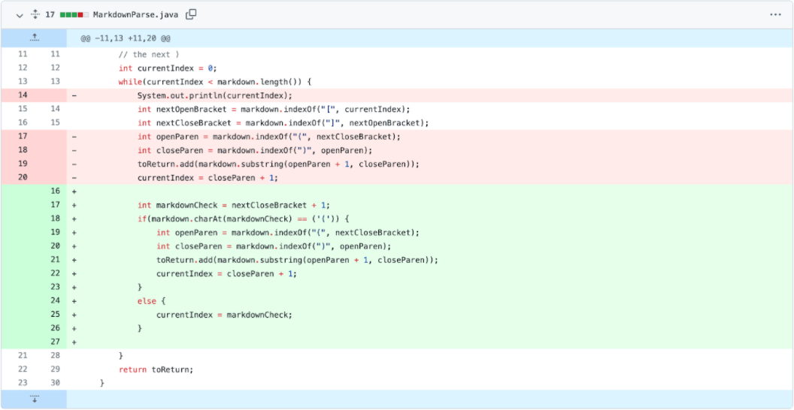

*After change for case 1:*

When the code is run again after the changes shown above, in the terminal below, when the test-file-two.md file is run with MarkDownParse.java, we can see the output, and we can also see that the test written for this specific case in the MarkdownParseTest.java file (also seen in the image) has passed.

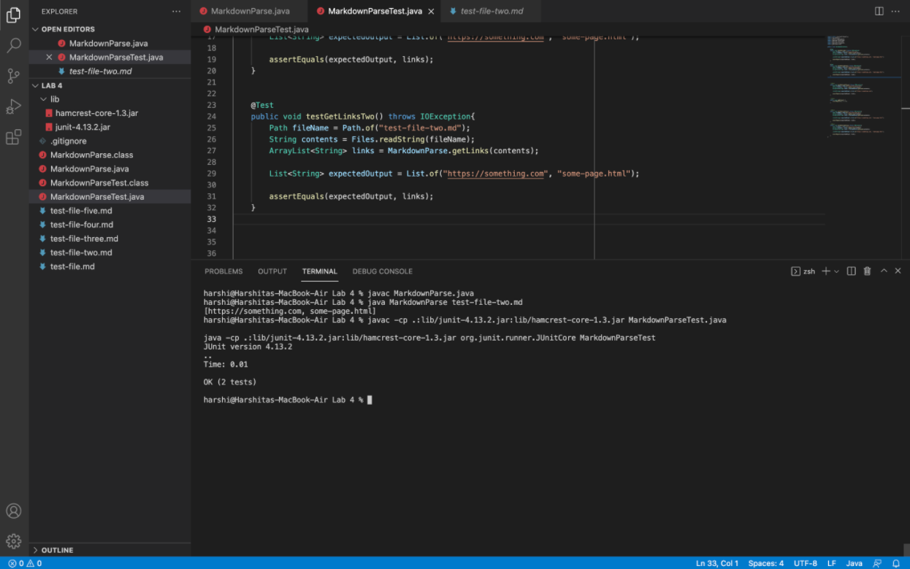

---
Our group made changes for two failure-inducing test files simultaneously, which is why there is a single commit seen for the second and third changes discussed in this lab. The bugs, symptoms, and failure-inducing inputs that prompted these changes however, will be analyzed separately.

[Change for case 2 and case 3](https://github.com/harshi-cse/markdown-parse/commit/c7d765f83ecdcd05fa099515d66eccbade8e3760#diff-c703a0ec03474d601c6bf846740b293e0538bccf38d5f677a302457479e9c652):

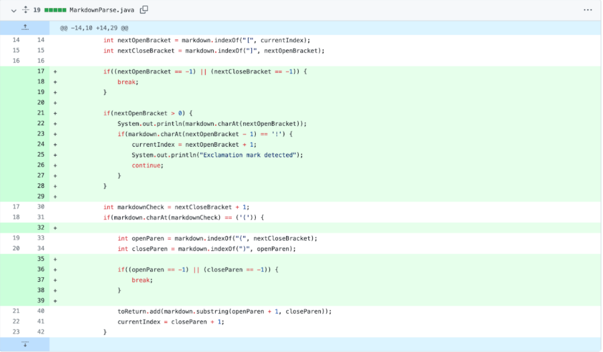

---
**Change 2:**

*Before change for case 2:*

With no further changes made to the code in MarkdownParse.java from case 1, we test the file on test-file-three.md([blob](https://github.com/harshi-cse/markdown-parse/blob/main/test-file-three.md), [raw](https://raw.githubusercontent.com/harshi-cse/markdown-parse/main/test-file-three.md)). 

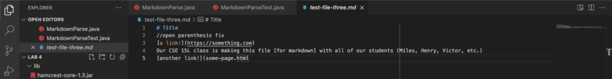

**Failure inducing input:**

As seen in the contents of test-file-three.md, line five contains a broken link, as it has square brackets followed by an open parenthesis but is missing a closed one. Since our code is only supposed to print out valid links in the file, the contents within the parentheses in line three should be the only output. 

**Symptom:**

In the terminal of the image below, when the test-file-three.md file is run with MarkDownParse.java, we see that an IndexOutOfBounds exception is thrown as the indexOf methods returns -1 (an invalid index) when the closed parentheses in line 6 of test-file-three.md is not found.We also see that the test written for this specific case in the MarkdownParseTest.java file (also seen in the image) has failed due to the same exception.

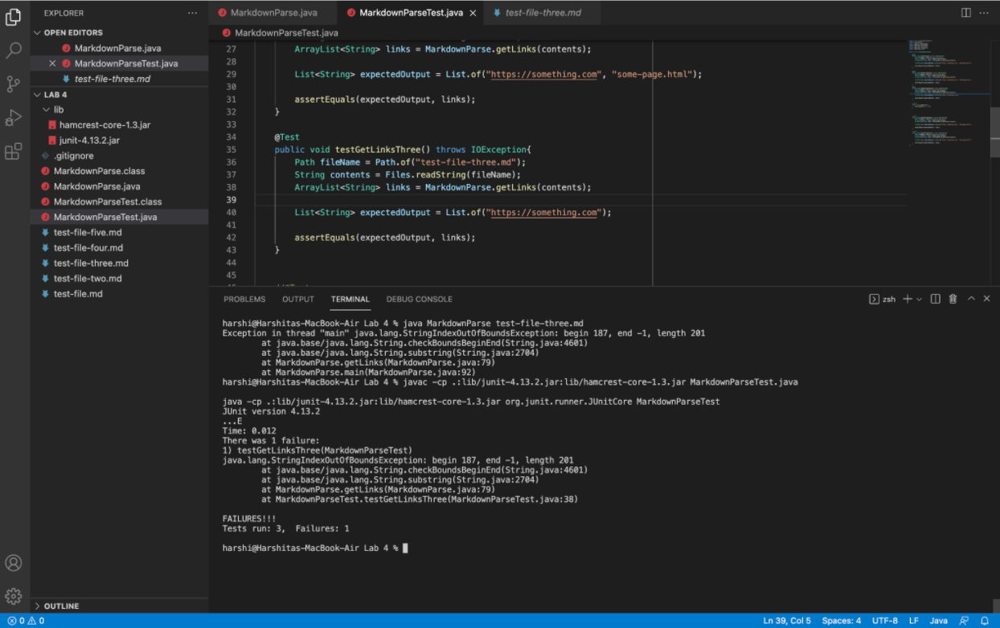

**Bug:**

In order to fix our output for case 2, our code must take into account that passed files may contain broken links that are missing at least one or more of either the necessary brackets or parentheses. 

Currently, the code does not check for this, and simply continues to search for brackets and parentheses necessary to constitute a valid link, with disregard for whether or not those characters actually exist in the remainder of the contents of the file that have not yet been searched for links.

*Change for case 2:*

In [the code changes seen below](https://github.com/harshi-cse/markdown-parse/commit/c7d765f83ecdcd05fa099515d66eccbade8e3760#diff-c703a0ec03474d601c6bf846740b293e0538bccf38d5f677a302457479e9c652), we added if statements to first check whether there are any open and closed brackets after the current index our method is at searching for links. If so, the program will continue and search for the next open and closed parenthesis, but if not, will exit the while loop searching for links, and will only print any valid links found up to that point. 

After the brackets are detected, we wrote another if statement to check if an open and closed parenthesis exist in the remaining length of the file from the current index. If not, the program will exit the while loop searching for links, and will only print any valid links found up to that point. 

Otherwise, the program will find the necessary parentheses, add the contents within the parentheses to the list of links to print, and will search for a new open bracket from the index after the closed parenthesis to search for any valid links remaining in the file. 

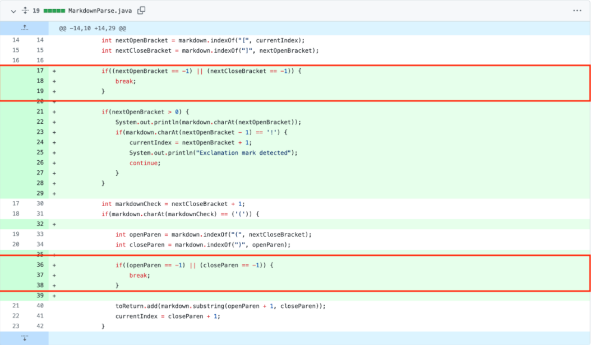

*After change for case 2:*

When the code is run again after the changes shown above, in the terminal below, when the test-file-three.md file is run, we can see the output, and we can also see that the test written for this specific case in the MarkdownParseTest.java file (also seen in the image) has passed.

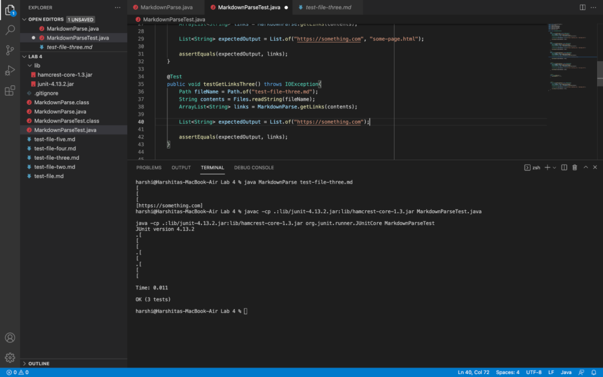

---

**Change 3:**

*Before change for case 3:*

With no further changes made to the code in MarkdownParse.java from case 1, we test the file on test-file-four.md([blob](https://github.com/harshi-cse/markdown-parse/blob/main/test-file-four.md), [raw](https://raw.githubusercontent.com/harshi-cse/markdown-parse/main/test-file-four.md)). 

Image](lab2_13.PNG)

**Failure inducing input:**

As seen in the contents of test-file-four.md, line six contains an image, as it has square brackets (followed by parentheses) preceded by an exclamation mark. Since our code is only supposed to print out valid links in the file, the contents within the parentheses in line three and five should be the only output. 

**Symptom:**

In the terminal of the image below, when the test-file-four.md file is run with MarkDownParse.java, we see that the output does in fact however, return the contents within the parentheses in line six of  test-file-four.md, and we also see that the test written for this specific case in the MarkdownParseTest.java file (also seen in the image, with expected values excluding the contents in parentheses in line six of test-file-four.md) has failed.

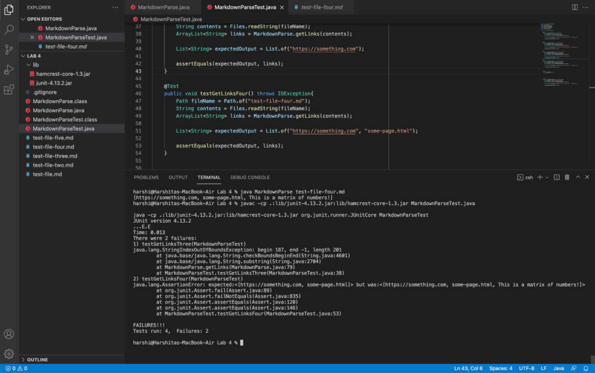

**Bug:**

In order to fix our output for case 3, our code must take into account the difference between syntax of links and images in markdown. The format of links is `[<link text>](<link url>)`, while the format of images is ``, thus differentiated by the `!` preceding the first open bracket. Currently, the code does not check for this, and simply returns the contents within the open and closed parentheses following the closed bracket, whether or not there is an exclamation mark immediately preceding the closed bracket. 

*Change for case 3:*

In [the code changes seen below](https://github.com/harshi-cse/markdown-parse/commit/c7d765f83ecdcd05fa099515d66eccbade8e3760#diff-c703a0ec03474d601c6bf846740b293e0538bccf38d5f677a302457479e9c652), we added if statements to check whether the character in the index before the index of the open bracket was an exclamation mark, and if so, the program will begin searching for any links starting at the index after the closed parenthesis without adding the contents within the parentheses to the list of links to print. 

Otherwise, the program will add the contents within the parentheses to the list of links to print, and will search for a new open bracket from the index after the closed parenthesis to search for any valid links remaining in the file. 

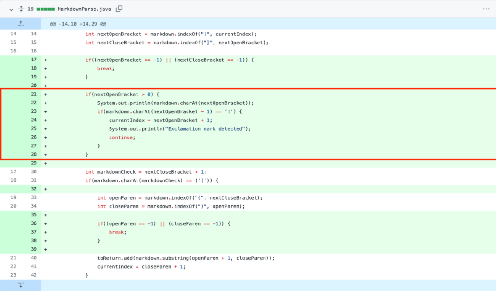

*After change for case 3:*

When the code is run again after the changes shown above, in the terminal below, when the test-file-four.md file is run with MarkDownParse.java, we can see the output, and we can also see that the test written for this specific case in the MarkdownParseTest.java file (also seen in the image) has passed.

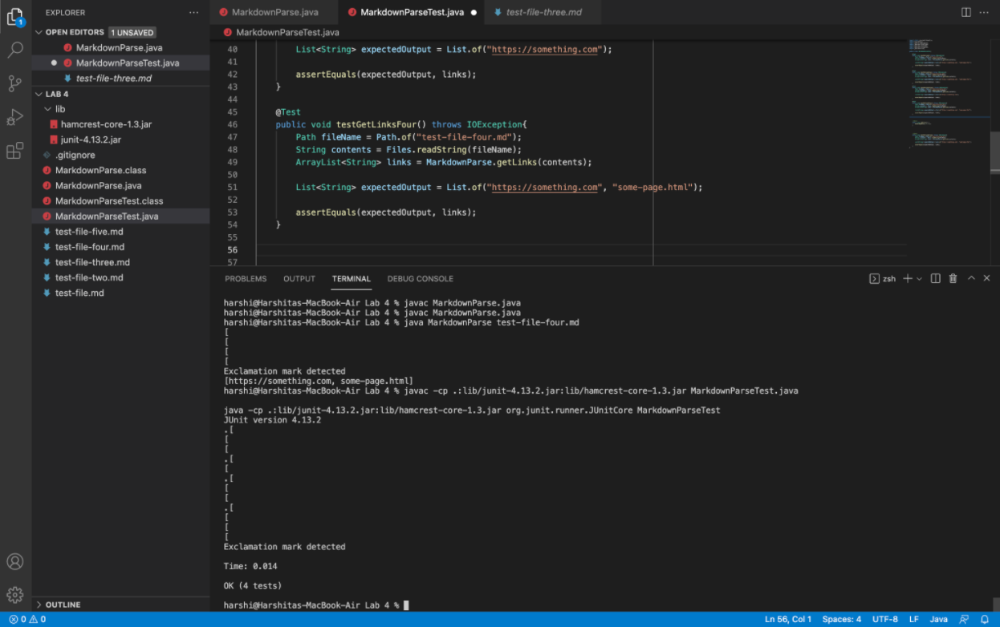
