# Lab Report 3 (Week 6)

**Group Choice 3**

**[Copying whole directories with `scp -r`](https://ucsd-cse15l-w22.github.io/week/week5/#group-choice-3-copy-whole-directories-with-scp--r)**

The `scp -r` command can be used to copy a directory. Unlike `scp`, which is used to copy an individual file, `scp -r` can copy an entire directory and its contents by copying recursively. 

In this example, `scp -r` will be used to copy the markdown-parse directory onto the ieng6 server. Logging into the course specific account, there is currently not a copy of markdown-parse on the server, as seen below.

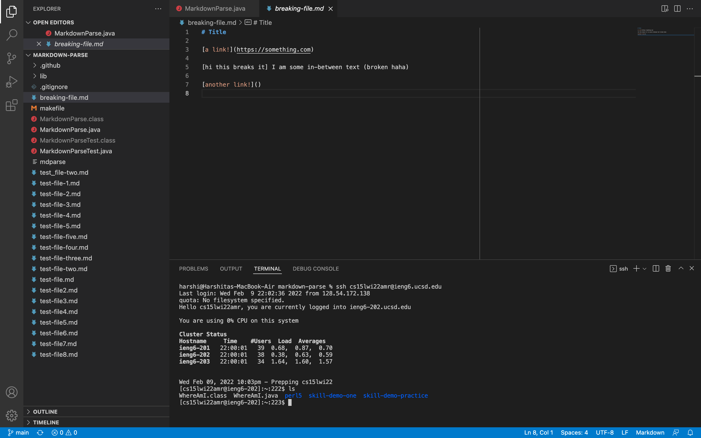

---
*Showing copying the whole markdown-parse directory to the ieng6 account:*

---
1. To begin, the working directory should be the one being copied. As seen below, using the `pwd` command, the current directory is markdown-parse. Its contents are also seen below using the `ls` command.
\
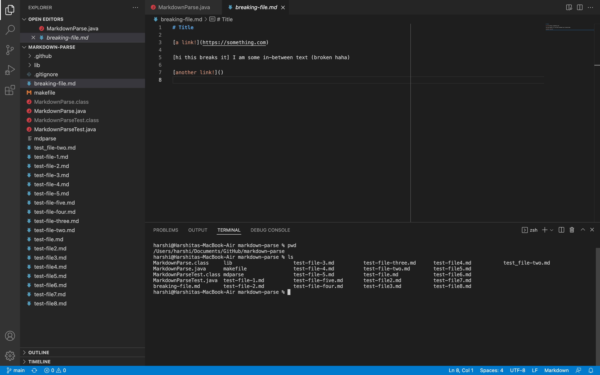

2. To copy the markdown-parse directory onto the ieng6 server, the following command is used:
`scp -r . cs15lwi22<course specific account>@ieng6.ucsd.edu:~/markdown-parse`. \
\
In this command, `-r` signifies recursive copying, the `.` represents the current directory (which is to be copied), and the `~/markdown-parse` indicates that the directory must be copied to a directory named markdown-parse on the server (which will be created by the command if it does not yet exist).\
\
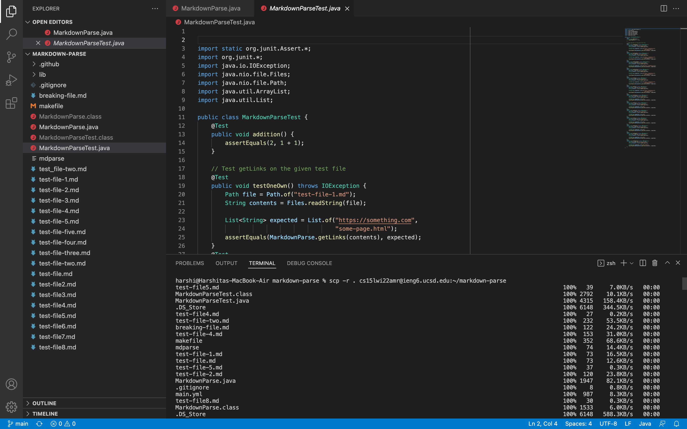

---
*Showing logging into the ieng6 account and compiling and running the tests for the repository:*

---

3. Logging into the server using the course specific account using the `ssh cs15lwi22<course specific account>@ieng6.ucsd.edu` and viewing its contents using the `ls` command, shows that the markdown-parse directory has successfully been copied onto the ieng6 server.\
\
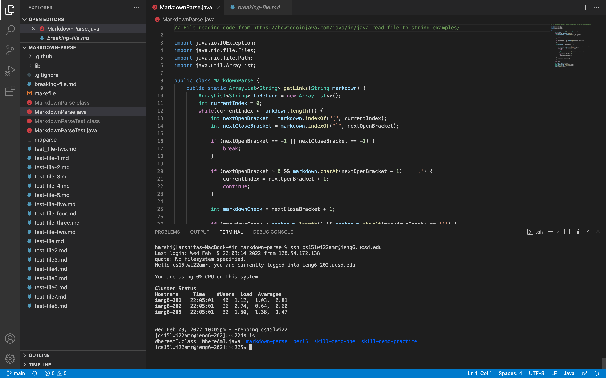\
\
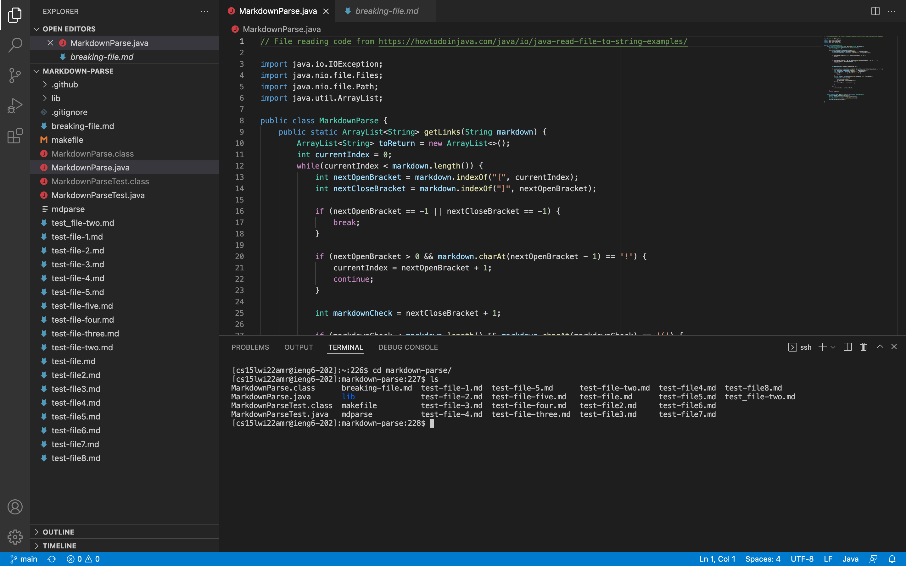


4. However, after changing into the markdown-parse directory using `cd markdown-parse/`, when the javac command to compile the test file (`javac -cp .:lib/junit-4.13.2.jar:lib/hamcrest-core-1.3.jar MarkdownParseTest.java`) is run on the server, the error below appears, indicating a class compilation version error.\
\
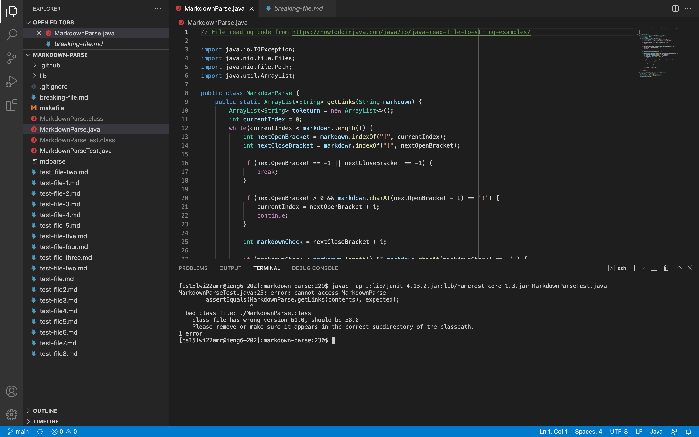\
\
To fix this ([using advice provided here](https://piazza.com/class/kxs0toocqhv4og?cid=353), and [code provided here](https://ucsd-cse15l-w22.github.io/week/week5/#group-choice-3-copy-whole-directories-with-scp--r)), after logging out of the server using `exit`, while in the local markdown-parse directory, the command `scp -r *.java *.md lib/ cs15lwi22<course specific account>@ieng6.ucsd.edu:markdown-parse` is used. This command only copies from the current directory, into the markdown-parse directory on the server, the lib subdirectory and files ending in `.java` or `.md` (so class files compiled with the local java version are not copied). \
\
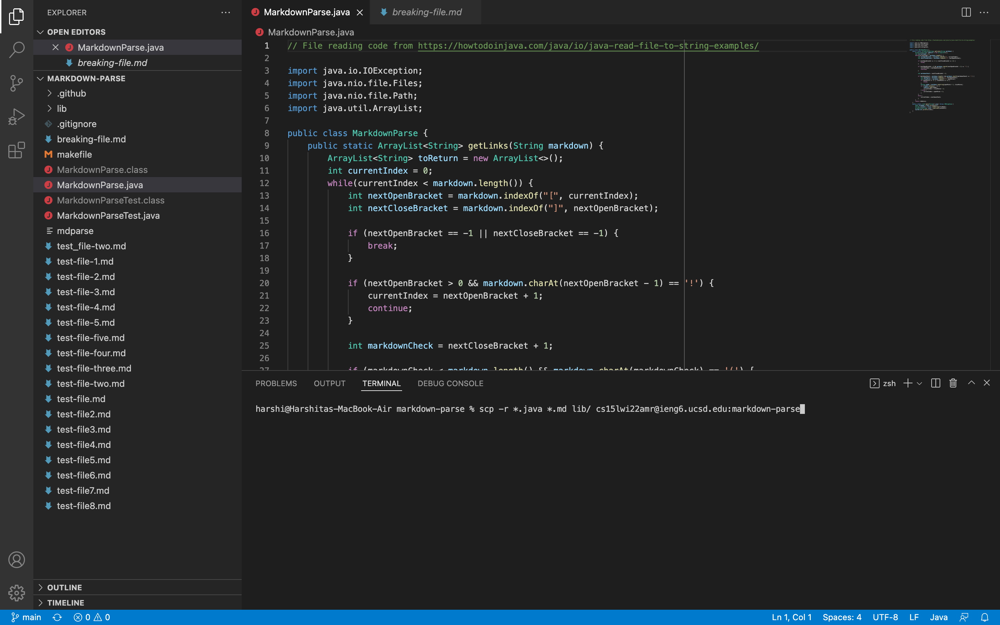
\
Now, after logging into the ieng6 server and changing into the markdown-parse directory using `cd markdown-parse/`, when the javac command (`javac -cp .:lib/junit-4.13.2.jar:lib/hamcrest-core-1.3.jar MarkdownParseTest.java`) is used, the class for the test file is recompiled using the java version present on the server, and no errors occur. Then the java command (`java -cp .:lib/junit-4.13.2.jar:lib/hamcrest-core-1.3.jar org.junit.runner.JUnitCore MarkdownParseTest`) is used to run the test file. As seen below, all the commands and tests run successfully. \
\
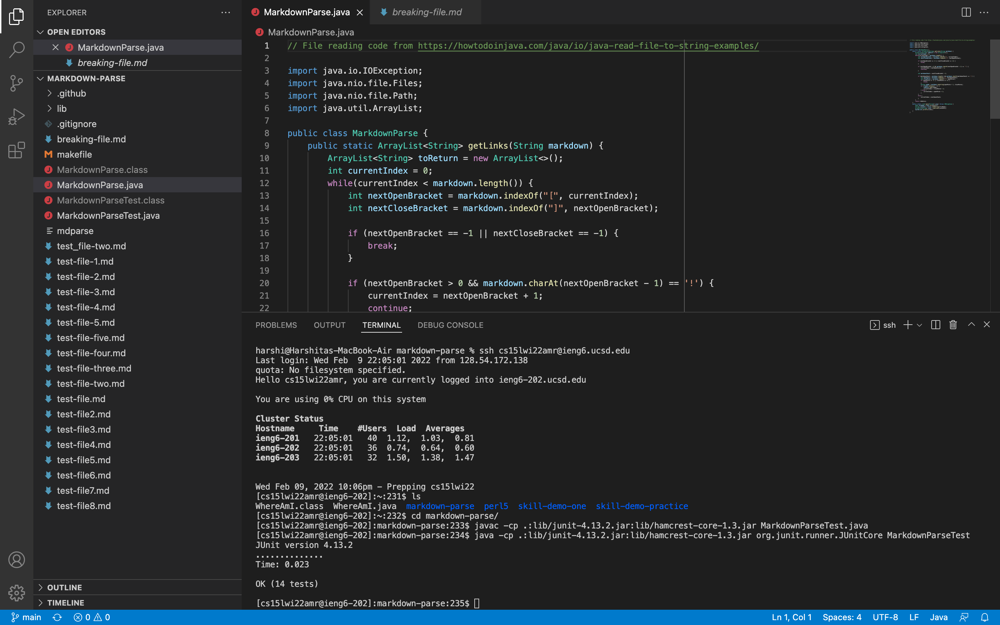

---
*Showing combining `scp`, `;`, and `ssh` to copy the directory and run the tests in one line*

---

5. To copy the directory and run the tests using one line, first delete the markdown-parse directory from the ieng6 serve by using the command `rm -rf markdown-parse` while logged into the server. Using `ls` after running this command shows that markdown-parse no longer exists on the server. After doing so, log out of the server using `exit`.\
\
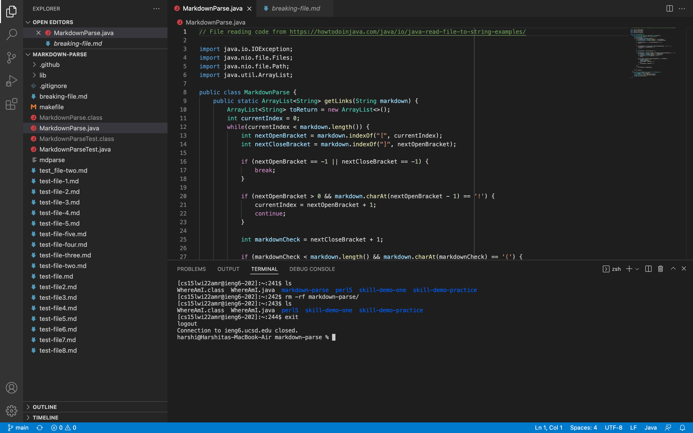

6. Now, while in the working directory markdown-parse on the local system, run the following line (which combines commands using [these tips](https://ucsd-cse15l-w22.github.io/week/week1/#part-7-making-remote-running-even-more-pleasant), and works around version errors [using this advice](https://piazza.com/class/kxs0toocqhv4og?cid=354)):\
\
```scp -r . cs15lwi22amr@ieng6.ucsd.edu:~/markdown-parse; scp -r *.java *.md lib/ cs15lwi22amr@ieng6.ucsd.edu:markdown-parse; ssh cs15lwi22amr@ieng6.ucsd.edu "cd markdown-parse/; /software/CSE/oracle-java-se-14/jdk-14.0.2/bin/javac -cp .:lib/junit-4.13.2.jar:lib/hamcrest-core-1.3.jar MarkdownParseTest.java; /software/CSE/oracle-java-se-14/jdk-14.0.2/bin/java -cp .:lib/junit-4.13.2.jar:lib/hamcrest-core-1.3.jar org.junit.runner.JUnitCore MarkdownParseTest"```. \
\
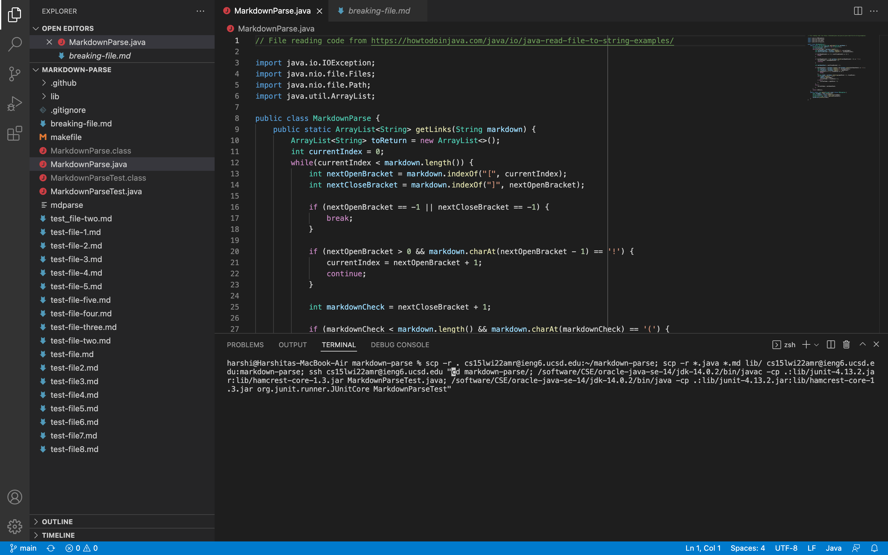\
\
As seen below, the directory is copied, the test file is compiled, and the test file runs successfully.\
\
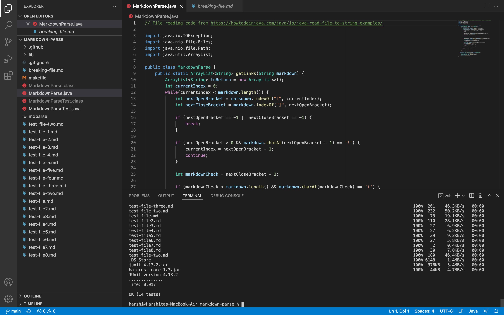\
\
Logging into the ieng6 server after this, the `ls` command can be used to verify that the server now cotains a copy of the markdown-parse directory.\
\
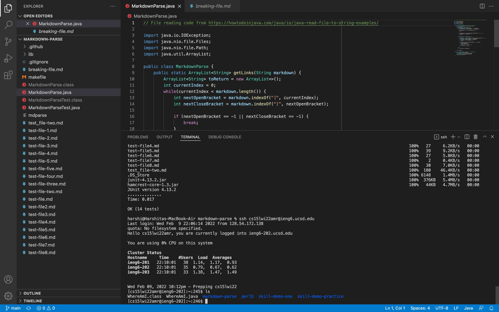


