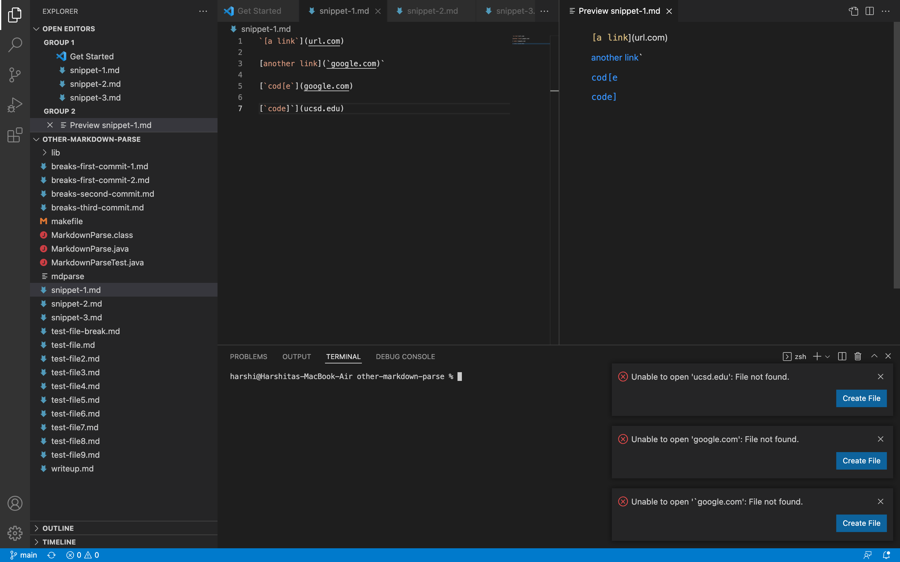
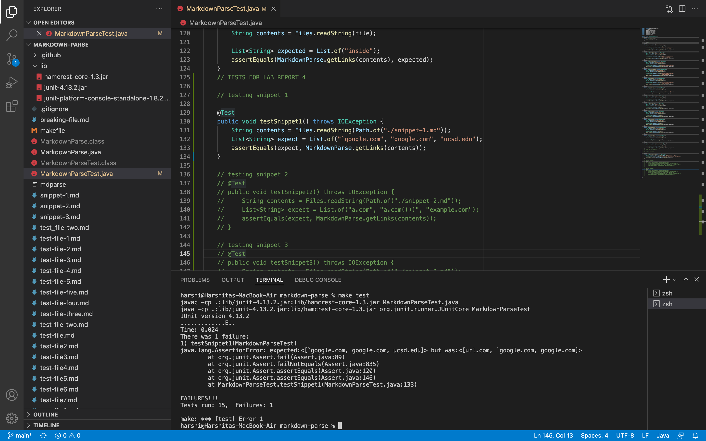
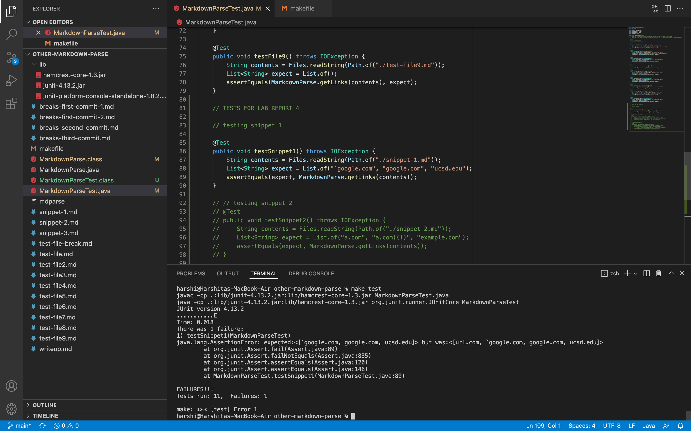
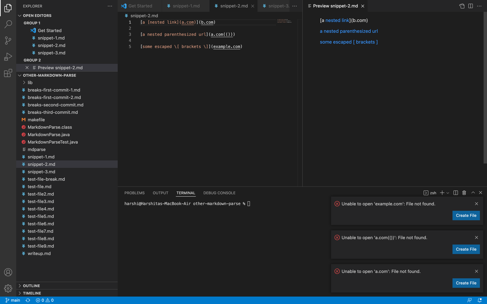
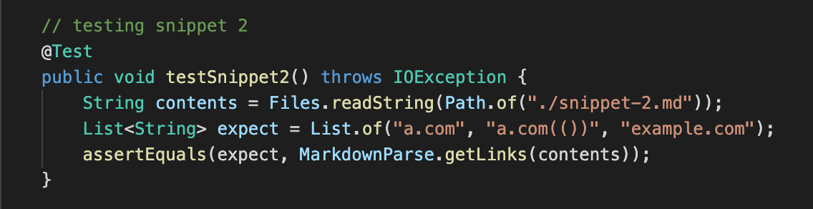
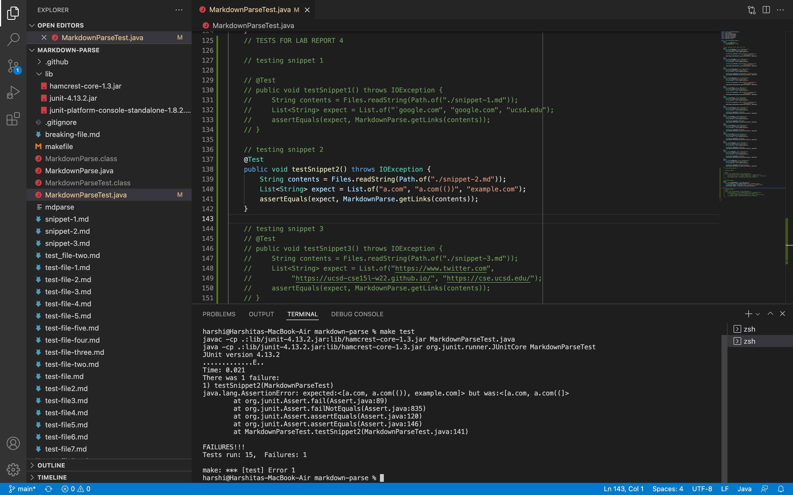
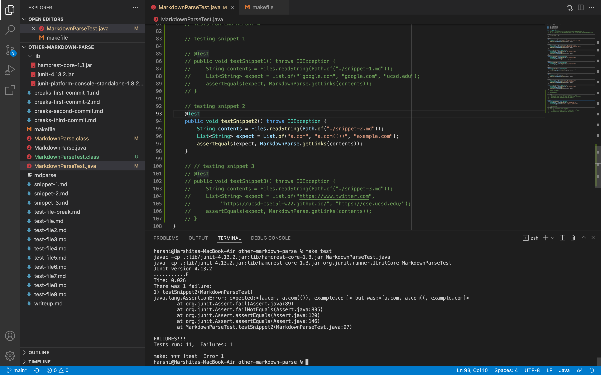
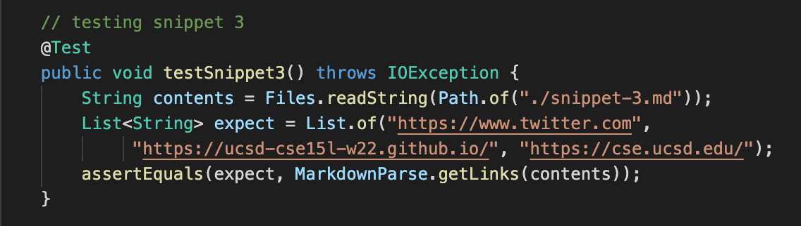
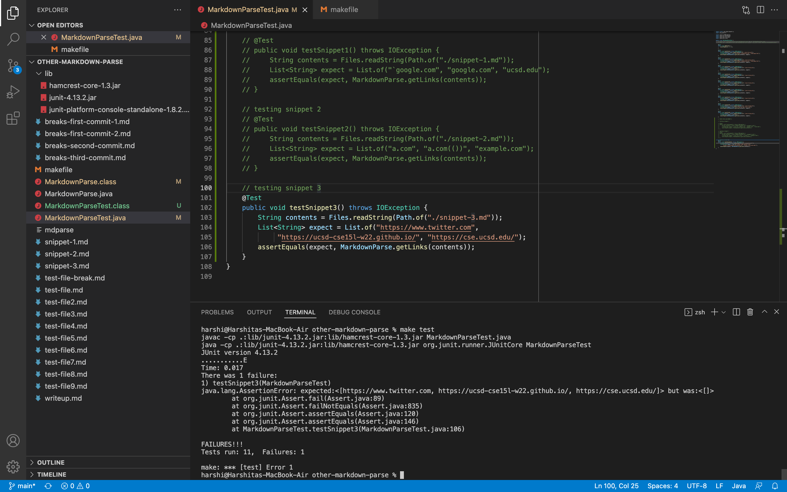

# Lab Report 4 (Week 8)

**Important links:**

- [Link to our group implementation of markdown-parse on my repo](https://github.com/harshi-cse/markdown-parse)
- [Link to other group implementation of markdown-parse on their repo](https://github.com/CatFish47/markdown-parse)
- [Link to other group implementation of markdown-parse on my repo](https://github.com/harshi-cse/other-markdown-parse)

---

**Snippet 1**

*What we expect:*

Using VSCode preview, we can see that snippet 1 should produce links as below (the links have also been clicked on to check urls):



This means that our expected output from running MarkDownParse.java on a markdown file with text from snippet 1 is:

```
[`google.com, google.com, ucsd.edu]
```
*Setting up the test:*

The code in the image below was added to the MarkdownParseTest.java files of the two repositories containing our implementation of markdown-parse, and that of the other group.


*Testing our group implementation:*

The implementation of the test and the output for Snippet 1 are seen below. The implementation of the other group did not pass the test. The error occurred in line 133.



getLinks output: 

```
[url.com, `google.com, google.com]
```

*Testing other group implementation:*

The implementation of the test and the output for Snippet 1 are seen below. The implementation of the other group did not pass the test. The error occurred in line 89.



getLinks output: 

```
[url.com, `google.com, google.com, ucsd.edu]
```

--- 

*Is there a small change in our code that can fix snippet 1 /related cases with inline code with backticks?*

---

**Snippet 2**

*What we expect:*

Using VSCode preview, we can see that snippet 2 should produce links as below (the links have also been clicked on to check urls):



This means that our expected output from running MarkDownParse.java on a markdown file with text from snippet 2 is:

```
[a.com, a.com(()), example.com]
```
*Setting up the test:*

The code in the image below was added to the MarkdownParseTest.java files of the two repositories containing our implementation of markdown-parse, and that of the other group.



*Testing our group implementation:*

The implementation of the test and the output for Snippet 2 are seen below. The implementation of the other group did not pass the test. The error occurred in line 141.



getLinks output: 

```
[a.com, a.com((]
```

*Testing other group implementation:*

The implementation of the test and the output for Snippet 2 are seen below. The implementation of the other group did not pass the test. The error occurred in line 97.



getLinks output: 

```
[a.com, a.com((, example.com]
```

---

*Is there a small change in our code that can fix snippet 2 /related cases with nest parentheses, brackets, and escaped brackets?*

---

**Snippet 3**

*What we expect:*

Using VSCode preview, we can see that snippet 3 should produce links as below (the links have also been clicked on to check urls):


This means that our expected output from running MarkDownParse.java on a markdown file with text from snippet 3 is:

```
[https://www.twitter.com, https://ucsd-cse15l-w22.github.io/, https://cse.ucsd.edu/]
```
*Setting up the test:*

The code in the image below was added to the MarkdownParseTest.java files of the two repositories containing our implementation of markdown-parse, and that of the other group.



*Testing our group implementation:*

The implementation of the test and the output for Snippet 3 are seen below. The implementation of our group passed the test.


getLinks output: 

```
[https://www.twitter.com, https://ucsd-cse15l-w22.github.io/, https://cse.ucsd.edu/]
```

*Testing other group implementation:*

The implementation of the test and the output for Snippet 3 are seen below. The implementation of the other group did not pass the test. The error occurred in line 106.



getLinks output: 

```
[]
```

---

*Is there a small change in our code that can fix snippet 3 /related cases with newlines in brackets and parentheses?*

Our implementation of markdown-parse passed the test case for Snippet 3. Our code does not check for new lines in the text within closed brackets, as that should be allowed in a valid link. We do however trim new lines from the ends of links within parentheses, as seen in [line 33](https://github.com/harshi-cse/markdown-parse/blob/6e1c1d8c4222c9932a3b2a65c5a8c2791fa04d01/MarkdownParse.java#L33), while making sure to treat links with new lines within the link url itself as invalid, as seen in [line 34](https://github.com/harshi-cse/markdown-parse/blob/6e1c1d8c4222c9932a3b2a65c5a8c2791fa04d01/MarkdownParse.java#L34).


