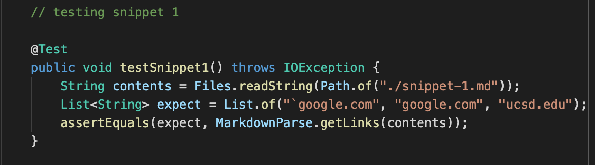
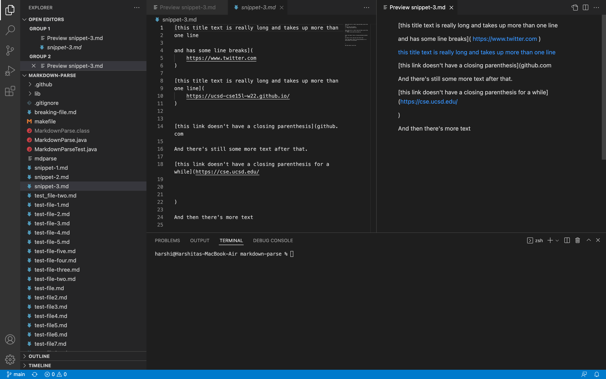
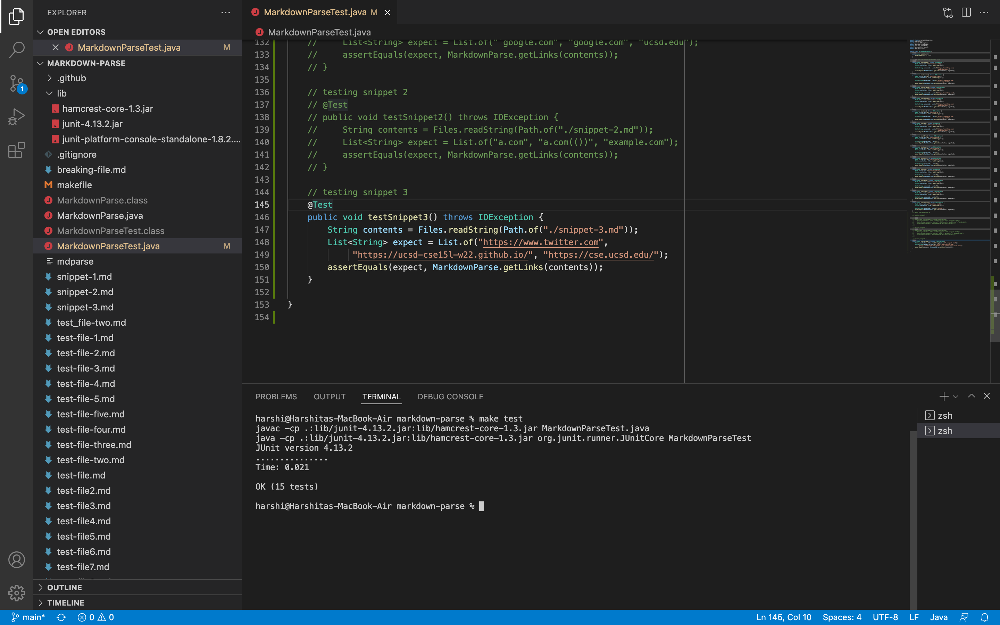

# Lab Report 4 (Week 8)

**Important links:**

- [Link to our group implementation of markdown-parse on my repo](https://github.com/harshi-cse/markdown-parse)
- [Link to other group implementation of markdown-parse on their repo](https://github.com/CatFish47/markdown-parse)
- [Link to other group implementation of markdown-parse on my repo](https://github.com/harshi-cse/other-markdown-parse)

---

**Snippet 1**

*What we expect:*

Using VSCode preview, we can see that snippet 1 should produce links as below (the links have also been clicked on to check urls):


This means that our expected output from running MarkDownParse.java on a markdown file with text from snippet 1 is:

```
[`google.com, google.com, ucsd.edu]
```
---

*Setting up the test:*

The code in the image below was added to the MarkdownParseTest.java files of the two repositories containing our implementation of markdown-parse, and that of the other group.



---

*Testing our group implementation:*

The implementation of the test and the output for Snippet 1 are seen below. The implementation of our group did not pass the test. The error occurred in line 133.


getLinks output: 

```
[url.com, `google.com, google.com]
```
---

*Testing other group implementation:*

The implementation of the test and the output for Snippet 1 are seen below. The implementation of the other group did not pass the test. The error occurred in line 89.


getLinks output: 

```
[url.com, `google.com, google.com, ucsd.edu]
```

--- 

*Is there a small change in our code that can fix snippet 1 / related cases with inline code with backticks?*

We can fix our code with a small change by checking for the indices of paired backticks with respect to the identified open / closed brackets and parentheses. 

When it comes to the characters in a line prior to the parentheses, we can identify the indices between a pair of backticks. If the first in the pair is at any point in the line before the closed bracket and the second is at any point after that backtick in the line, we should make it so that our code does not set any values of open / closed brackets to indices between the backticks. 

As for backticks paired within the parentheses, or with a pair with the first backtick within the parentheses, they do not appear to invalidate a link, so our program will work in that case as expected.

---

**Snippet 2**

*What we expect:*

Using VSCode preview, we can see that snippet 2 should produce links as below (the links have also been clicked on to check urls):


This means that our expected output from running MarkDownParse.java on a markdown file with text from snippet 2 is:

```
[a.com, a.com(()), example.com]
```
--- 

*Setting up the test:*

The code in the image below was added to the MarkdownParseTest.java files of the two repositories containing our implementation of markdown-parse, and that of the other group.


---

*Testing our group implementation:*

The implementation of the test and the output for Snippet 2 are seen below. The implementation of our group did not pass the test. The error occurred in line 141.


getLinks output: 

```
[a.com, a.com((]
```

---

*Testing other group implementation:*

The implementation of the test and the output for Snippet 2 are seen below. The implementation of the other group did not pass the test. The error occurred in line 97.


getLinks output: 

```
[a.com, a.com((, example.com]
```

---

*Is there a small change in our code that can fix snippet 2 / related cases with nest parentheses, brackets, and escaped brackets?*


We cannot fix our code with a small change. 

If the index before the index of any identified open / closed bracket / parenthesis contains a backslash, that bracket / parenthesis should be ignored and the new index for that variable should be set as the next valid occurence of the character without a backslash. 

For an identified pair of brackets, we can check if there is another valid link within it. However, it will be challenging to code for which open / closed brackts and parentheses shoudl be valid pair for the link, which ones should not be, and also to check for pairs of parentheses as nested rather than simply adjacent pairs. 

Since our code currently just uses the first occurence of an open bracket / parenthesis and pair it with the closest closed bracket / parenthesis, we must rewrite our code to check for pairs diffently, such as for example going out from the inner most pair (the pair of brackets / parentheses with the least space between them) and checking for more pairs outwards from there. The code must then assign valid portions of the link structure accordingly and then print the link.

Coding for this is possible, but potentially not easy enough to be implemented in less than 10 lines of code.

---

**Snippet 3**

*What we expect:*

Using VSCode preview, we can see that snippet 3 should produce links as below (the links have also been clicked on to check urls):



This means that our expected output from running MarkDownParse.java on a markdown file with text from snippet 3 is:

```
[https://www.twitter.com, https://ucsd-cse15l-w22.github.io/, https://cse.ucsd.edu/]
```

---

*Setting up the test:*

The code in the image below was added to the MarkdownParseTest.java files of the two repositories containing our implementation of markdown-parse, and that of the other group.


---

*Testing our group implementation:*

The implementation of the test and the output for Snippet 3 are seen below. The implementation of our group passed the test.



getLinks output: 

```
[https://www.twitter.com, https://ucsd-cse15l-w22.github.io/, https://cse.ucsd.edu/]
```
---

*Testing other group implementation:*

The implementation of the test and the output for Snippet 3 are seen below. The implementation of the other group did not pass the test. The error occurred in line 106.


getLinks output: 

```
[]
```

---

*Is there a small change in our code that can fix snippet 3 / related cases with newlines in brackets and parentheses?*

Our implementation of markdown-parse passed the test case for Snippet 3. 

Our code does not check for new lines in the text within closed brackets, as that should be allowed in a valid link. 

We do however trim new lines from the ends of links within parentheses, as seen in [line 33](https://github.com/harshi-cse/markdown-parse/blob/6e1c1d8c4222c9932a3b2a65c5a8c2791fa04d01/MarkdownParse.java#L33), while making sure to treat links with new lines within the link url itself as invalid, as seen in [line 34](https://github.com/harshi-cse/markdown-parse/blob/6e1c1d8c4222c9932a3b2a65c5a8c2791fa04d01/MarkdownParse.java#L34).


