# Lab Report 5 (Week 10)

**Important links:**
- [Implementation of markdown-parse from lab 9](https://github.com/ucsd-cse15l-w22/markdown-parse)
- [Implementation of markdown-parse by our group](https://github.com/harshi-cse/markdown-parse)
- [Commands used to complete this report](https://ucsd-cse15l-w22.github.io/week/week9/)

---

**How I found tests with different results:**

---

*What I did with the provided implementation:*

---

After cloning the markdown-parse repository provided [here](https://github.com/ucsd-cse15l-w22/markdown-parse) for lab 9, in the `script.sh` file, I added the line `echo $file` to line 4 before the command to run MarkdownParse on the file, as below:

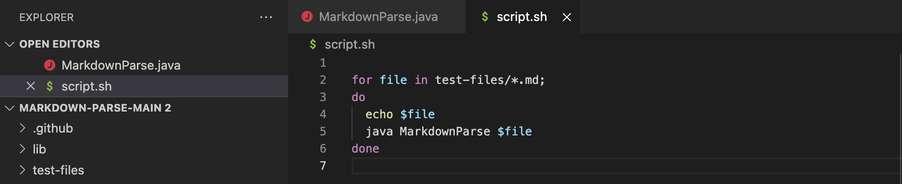

The `script.sh` file loops through all the files in the `test-files` directory, outputting the name, followed by the result of calling the lab 9 implementation of markdown-parse on the test file, for each of the test files.

Then, in the terminal while in the directory containing the lab 9 markdown-parse repo clone, I entered the command `bash script.sh > results.txt`, which created a file that looks like this:

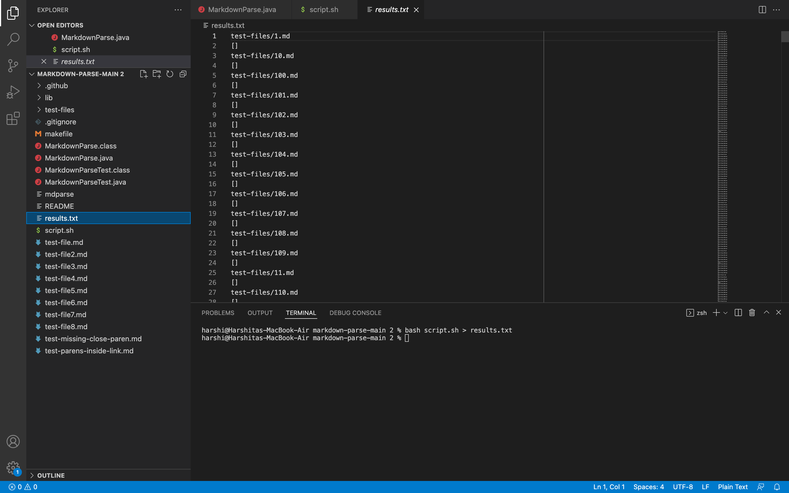

This command stores the output of `script.sh` for each test file into a new file called `results.txt`.

---

*What I did with our group implementation:*

---

In my clone of the markdown-parse repository containing the markdown-parse implementation of my group, seen [here](https://github.com/harshi-cse/markdown-parse), I copied over the `test-files` directory and the `script.sh` file from my clone of the lab 9 markdown-repository (which now has `echo $file` added in to `script.sh` as previously described).

The `script.sh` file loops through all the files in the `test-files` directory, outputting the name, followed by the result of calling our group implementation of markdown-parse on the test file, for each of the test files.

Then, in the terminal while in the directory containing my group markdown-parse repo clone, similar to the step for the lab 9 markdown-parse clone, I entered the command `bash script.sh > results.txt`, which created a file that looks like this:

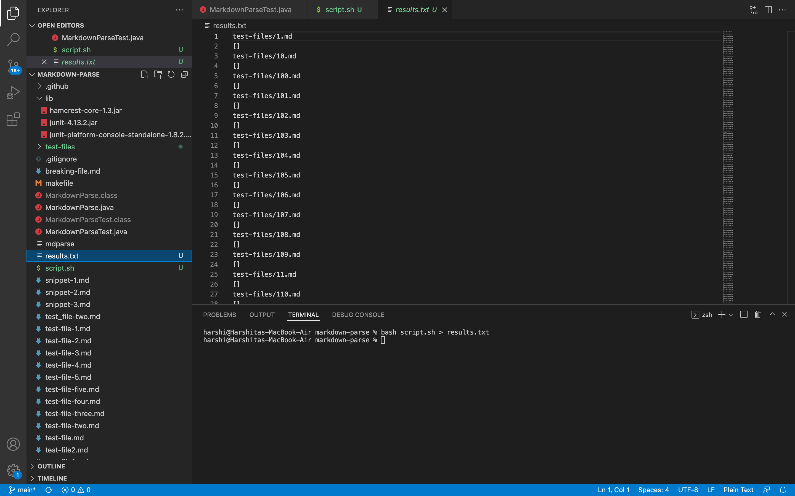

This command stores the output of `script.sh` for each test file into a new file called `results.txt`.

---

*How I put things together to find differences:*

---

While in the directory containing my clone of the lab 9 markdown-parse repo, I entered the command `diff ./results.txt /Users/harshi/Documents/Github/markdown-parse/results.txt `. 

Running this command produced output as below:

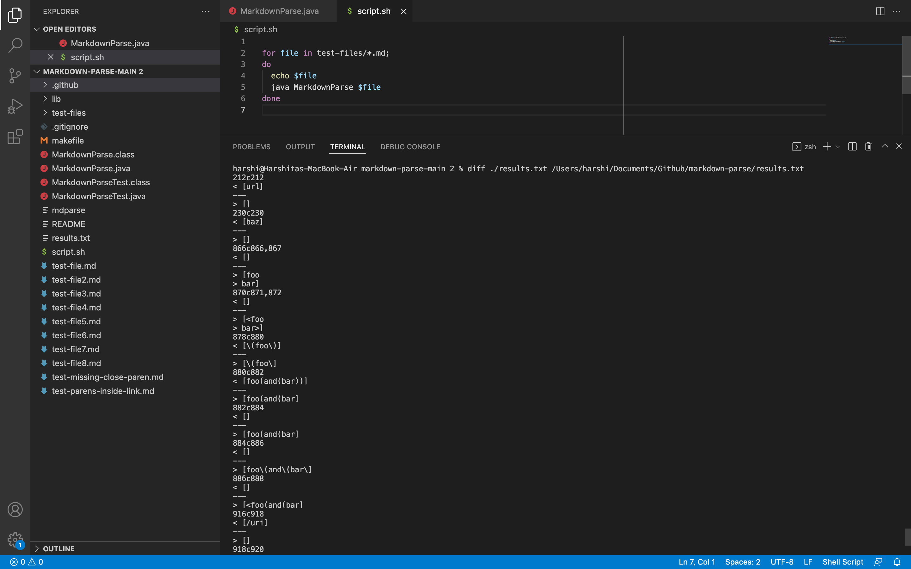

In the `diff` command, the first argument is the path to the `results.txt` file for the lab 9 markdown-parse implementation, and the second is the path to the `results.txt` for my group markdown-parse implementation. 

Thus for each line by line comparison of differences, the text following the `<` symbol is from the lab 9 markdown-parse implementation while the text following the `>` symbol is from our group markdown-parse implementation.

---

**First test difference:**

---

For this output after running the `diff` command:

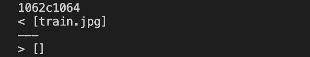

The difference appears to be at line 1062 and 1064 of the `results.txt` files for the lab 9 and our group implementation of markdown-parse respectively.

By navigating to the `results.txt` files for the lab 9 implementation, we see in the line above 1062 (1061) that the differences in output are from test file `577.md`.

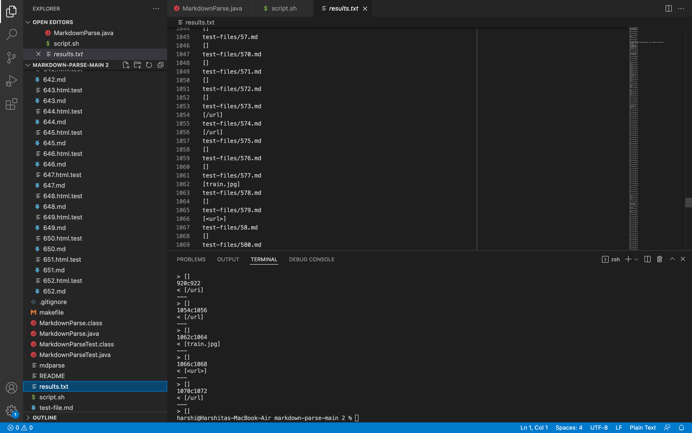

---

*Which implementation is correct:*

---

The expected output for test file `577.md` should be `[]`, as observed when looking at the preview for the file below, as there is only an image written in the file (an exclamation mark before the open bracket). 

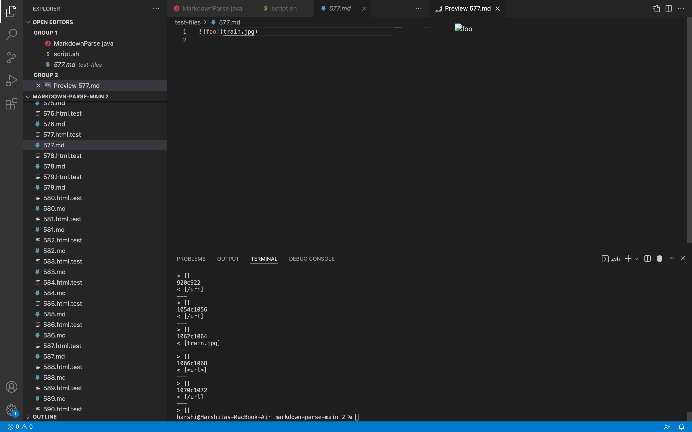

The lab 9 implementation of markdown-parse outputs `[train.jpg]`, while our group implementation outputs `[]`. Therefore, our group implementation is correct, while the lab 9 implementation is wrong.

---

*Describing bugs:*

---

The bug in the lab 9 implementation of markdown-parse is that in the getLinks method called on a String, the method does not check if the character before the open bracket is `!`. This is a problem because images have the same syntax as links in markdown and are only differentiated by the exclamation mark preceding the open bracket. This leads to the lab 9 implementation incorrectly interpreting images as links.

In our group implementation, we check for the character at the index before the open bracket, and if it is `!`, we set the currentIndex variable to the index after the identified open bracket and begin a new iteration of the while loop, [as such](https://github.com/harshi-cse/markdown-parse/blob/2ba9e75cff8c295f7daf765d5346c58bc81f23dc/MarkdownParse.java#L20):


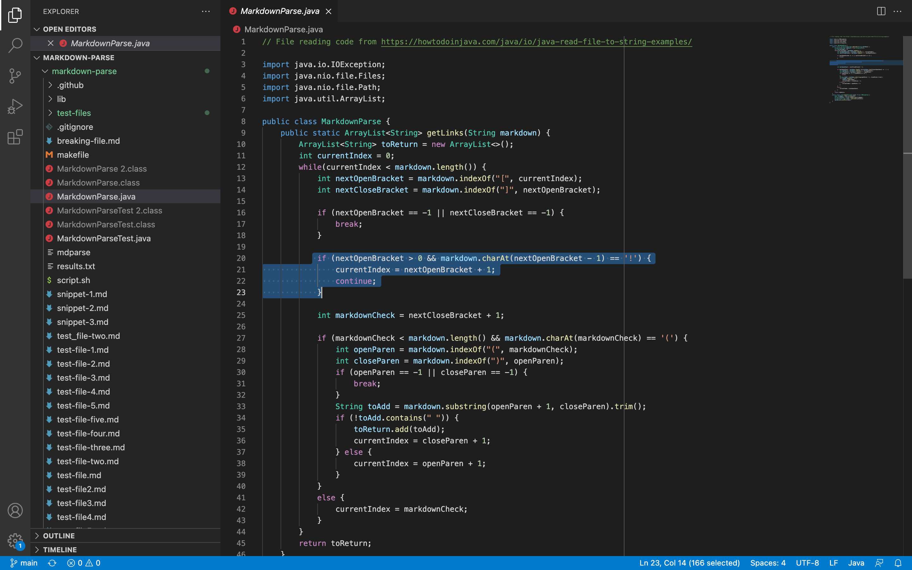

Similarly, the lab 9 implementation should check the character at the index before the identified index of the open bracket, and if it is `!`, the method should set the currentIndex variable to the index after the identified open bracket, and begin the next iteration of the while loop to search for a new potential link.

In order to do so, after [this line](https://github.com/ucsd-cse15l-w22/markdown-parse/blob/44a15db11dbadaa0053f1308fa4f9a6336153b31/MarkdownParse.java#L57) in the lab 9 implementation, the following code should be added:

```
if (nextOpenBracket > 0 && markdown.charAt(nextOpenBracket - 1) == '!') {
                currentIndex = nextOpenBracket + 1;
                continue;
}
```

Such that that code should now look like this:

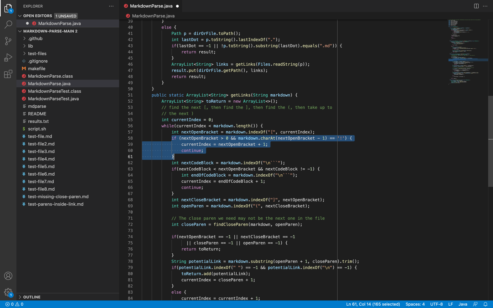

---

**Second test difference:**

---

For this output after running the `diff` command:

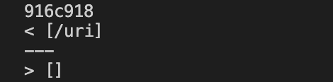

The difference appears to be at line 916 and 918 of the `results.txt` files for the lab 9 and our group implementation of markdown-parse respectively.

By navigating to the `results.txt` files for the lab 9 implementation, we see in the line above 916 (915) that the differences in output are from test file `510.md`.

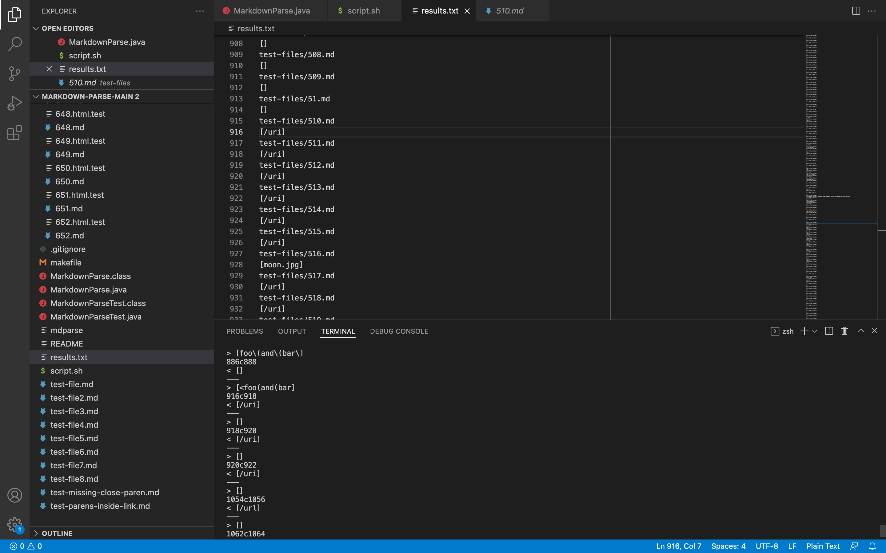

---

*Which implementation is correct:*

---

The expected output for test file `510.md` should be `[]`, as observed when looking at the preview for the file below, as there is a space between the closed bracket and the open parenthesis. 

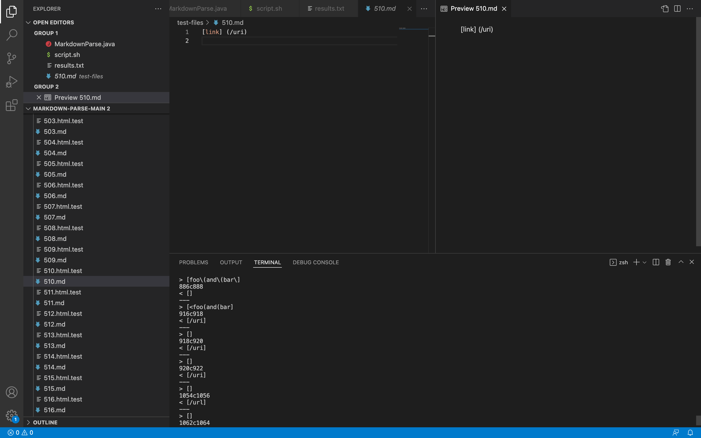

The lab 9 implementation of markdown-parse outputs `[/uri]`, while our group implementation outputs `[]`. Therefore, our group implementation is correct, while the lab 9 implementation is wrong.

---

*Describing bugs:*

---

The bug in the lab 9 implementation of markdown-parse is that in the getLinks method called on a String, the method does not check that the character after the closed bracket is `(`. This is a problem because valid links cannot have any space or other characters between `]` and `(` according to markdown link syntax. This leads to the lab 9 implementation incorrectly interpreting an occurence of `]` not immediately followed by `(` as being part of a valid link.

In our group implementation, we check for the character at the index after the closed bracket, and if it is `(`, only then do we continue identifying the indices of following parentheses to add valid links to the String ArrayList that the method should return, [as such](https://github.com/harshi-cse/markdown-parse/blob/2ba9e75cff8c295f7daf765d5346c58bc81f23dc/MarkdownParse.java#L27):


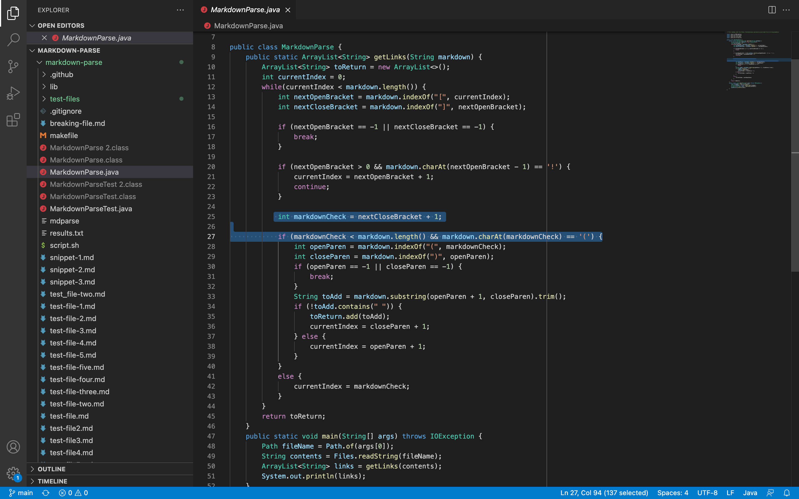

Similarly, the lab 9 implementation should check the character at the index after the identified index of the closed bracket, and if it is `(`, the method should continue identifying the indices of following parentheses to add valid links to the String ArrayList that the method should return. Otherwise the method shoudl set currentIndex to the index after the closed bracket, and begin the next iteration of the while loop to search for a new potential link.

In order to do so, after [this line](https://github.com/ucsd-cse15l-w22/markdown-parse/blob/44a15db11dbadaa0053f1308fa4f9a6336153b31/MarkdownParse.java#L65) in the lab 9 implementation, the following code should be added:

```
if (openParen != nextCloseBracket + 1) {
                currentIndex = nextCloseBracket + 1;
                continue;
}
```

Such that that code should now look like this:

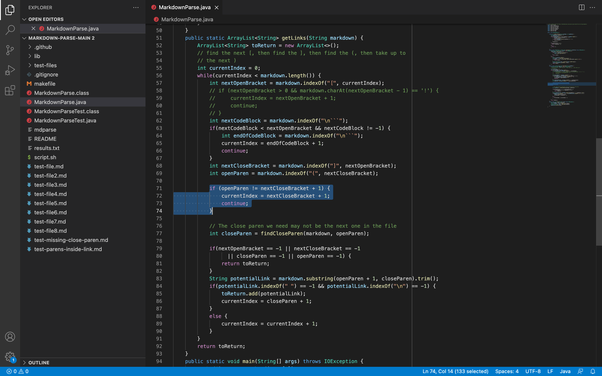
